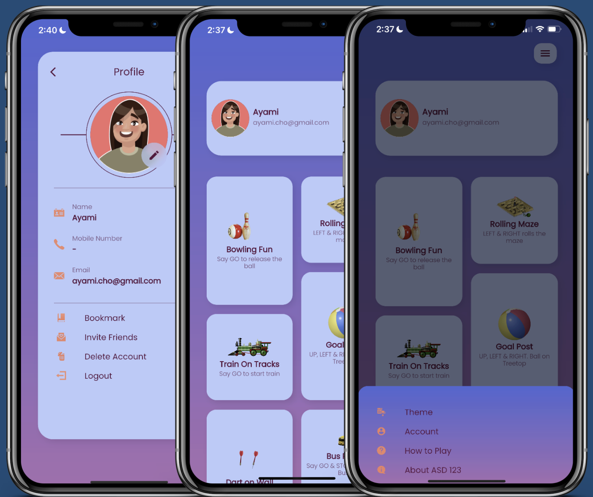
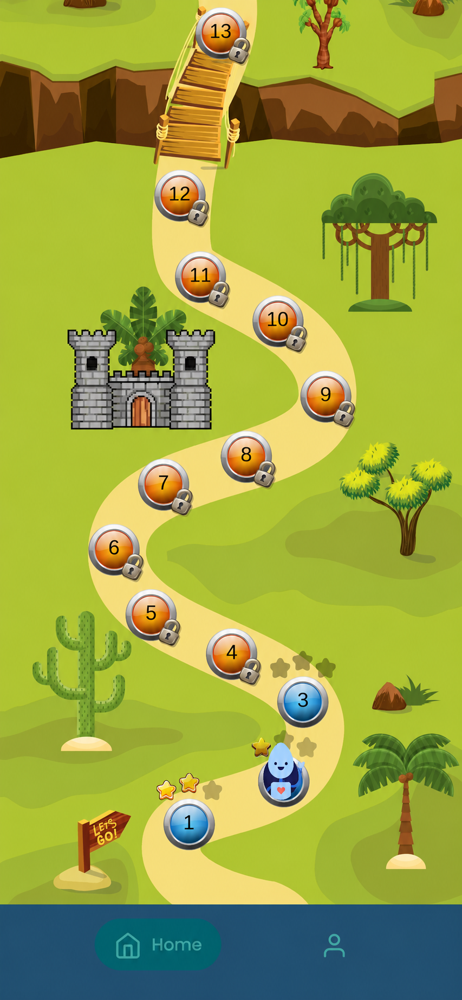

# ASD123 Product Research

Product research for an AI-supported speech-development app, from a constrained research environment to shipped product recommendations.

## Project Snapshot

**Role:** Research Lead  
**Research sprint:** Oct–Nov 2023  
**Product launch:** March 2026  
**Impact follow-up:** August 2026  

**Methods:** Stakeholder interviews, competitive and market research, accessibility research, qualitative synthesis, affinity mapping, research-to-design translation

**Research participants:** 7
- 4 speech-language pathologists
- 2 guardians
- 1 special-education teacher

## From Research to Product

| Earlier ASD123 experience | Live product, 2026 |
| --- | --- |
|  |  |

Two research-backed directions from the 2023 study, visible progression through an activity roadmap and a rewards system, were later incorporated into the launched product.

### Prototype Walkthrough

The 2023 prototype shows how the UI team translated the research recommendations into a proposed product experience, including visible progression, rewards, activity choice, onboarding, audio guidance, and accessibility controls.

[▶ Watch the full ASD123 prototype walkthrough on YouTube](https://www.youtube.com/shorts/0XU4k_mGTg4)

**Prototype UI:** Ayami  
**Research direction and recommendations:** Catherine Geissler

## The Product Challenge

ASD123 began as a speech-development product designed around therapeutic activities.

The founders wanted to move toward something broader: a children's gaming experience that could still serve a therapeutic purpose and work both inside and outside formal therapy.

That created a product question larger than interface redesign:

> **How could ASD123 preserve therapeutic structure while becoming engaging and intuitive enough for children and families to use at home?**

My role was to understand the experience well enough to give the product team evidence-backed direction.

## The Research Problem Changed Immediately

Before meeting the founders, I was concerned about a fundamental research problem.

How could I, as a researcher, meaningfully contribute to a product serving children with speech-development needs and conditions such as autism when speech-language pathologists already had far deeper clinical expertise?

My job was not to tell clinicians how therapy should work.

My job was to understand the experience surrounding that therapy.

That distinction became more important when direct access to ASD123's existing child users was restricted.

Instead of recruiting unrelated children or pretending proxy participants were equivalent to direct users, I reframed the study around the environment surrounding the child.

I asked:

> **Who sees the child in the situations this product is trying to support, and what can each of those people tell me that the others cannot?**

That led to three research perspectives:

- **Speech-language pathologists** for therapeutic structure, regression, engagement, and what practice between sessions needed to accomplish
- **Guardians** for home routines, progress visibility, involvement, and how to create a supportive environment outside therapy
- **A special-education teacher** for attention, regulation, motivation, and activities that consistently generated participation

[Read the research strategy →](notes/research_strategy.md)

## I Used the First Five Days Differently

The founder kickoff was delayed until five days into a three-week sprint.

Rather than wait, I used that time to reduce uncertainty.

The team researched:

- the existing ASD123 product and publicly available founder interviews;
- children's UI patterns;
- interface considerations for autistic children;
- accessibility and WCAG guidance;
- visual treatment, color, typography, and sensory considerations;
- speech-development apps and adjacent products;
- competitive patterns in products that had already moved from a therapy-oriented experience toward children's gaming.

I maintained a shared Miro board so the research team and UI team could work from the same evidence base.

The UI designers initially had less interest in the research work, but their involvement changed once I asked them to interpret the accessibility and visual-design evidence from their own discipline.

That became an early example of how I learned to use cross-functional expertise rather than treating research as something that belonged only to the researchers.

By the time we met the founders, we had enough context to ask much better questions.

## What the Research Changed

The interviews did not reveal that children with developmental or speech-related needs required an entirely different motivational system.

That surprised me.

Across the research, children still responded to familiar things:

- play;
- immediate rewards;
- visible progress;
- choice;
- engaging activities;
- clear goals.

The differences appeared more in the level of care required around:

- sensory sensitivity;
- distraction;
- emotional regulation;
- predictability;
- accessibility;
- individual variation.

The research shifted my thinking from:

> "How do we design a special experience for these children?"

toward:

> **"How do we create a familiar children's experience with enough flexibility and support to accommodate a wider range of needs?"**

That became the foundation of the product direction.

## Three Perspectives, One Experience

The participant groups did not strongly contradict one another.

They illuminated different parts of the same system.

### Speech-language pathologists

Clinicians emphasized continuity between sessions.

One recurring concern was regression when therapy or practice was inconsistent.

The product therefore had an opportunity to extend therapeutic structure into the time between appointments.

### Guardians

Parents were not resistant to being involved.

The challenge was understanding **how** to participate.

They wanted clearer ways to understand progress, support practice at home, and know what role they should play in the experience.

### Education

The special-education perspective sharpened the question of attention and motivation.

What creates buy-in?

What holds a child's attention?

What helps regulate an activity rather than overwhelm the child?

That line of research became especially important in the eventual rewards recommendation.

## From Evidence to Product Direction

I combined stakeholder interviews with competitive, market, and accessibility research.

Competitive analysis played two roles.

First, it established the category standards ASD123 would need to meet if it wanted to compete as a children's gaming experience.

Second, because the interview sample was small and distributed across different stakeholder groups, competitive evidence gave me another source to pressure-test and strengthen product recommendations.

I selected competitors that had successfully bridged speech-development or therapeutic use with children's gaming.

The synthesis ultimately produced six product opportunities:

1. Activity roadmap and visible progression
2. Rewards and milestones
3. Activity library and greater choice
4. Onboarding assessment
5. Audio guidance
6. Accessibility and parent controls

The evidence was not equally strong for all six.

The roadmap, rewards, and activity library were most directly supported by participant research.

Accessibility and audio guidance were reinforced by accessibility research.

Onboarding appeared strongly across the competitive landscape but was more dependent on clinical expertise than the other recommendations.

[See how the evidence became product decisions →](notes/evidence_to_decisions.md)

## The Strongest Product Idea Was Guided Flexibility

The recommendations were not six unrelated features.

Together they pointed toward one product strategy:

> **Guided flexibility**

Children needed enough structure to understand where they were, what came next, and why they should continue.

But the experience also needed enough flexibility to account for substantial variation in interest, sensory needs, attention, and developmental level.

This meant the product itself needed to carry some of the support that would normally come from a clinician.

## Research Handoff and Product Decisions

I synthesized the interviews independently, transcribed the conversations, converted observations into sticky notes, and transferred the evidence into our shared Miro environment.

The product team then reviewed the recommendations together.

I originally wanted to narrow the final design scope and develop fewer recommendations in greater depth.

The UI team felt they had capacity to explore all six.

We ultimately chose breadth.

My role in the handoff was functional rather than visual.

I defined what the evidence suggested the product should accomplish and participated in decisions about which recommendations to carry forward.

Ayami owned the interface and visual execution.

That separation is important to this case study:

**I influenced what the product needed to do. I did not design what the screens looked like.**

## What Shipped

The live product ultimately incorporated two recommendations particularly strongly:

- **Activity roadmap**
- **Rewards system**

Both addressed the same core problem:

> How do you give a child a reason to keep moving through therapeutic activities without making the experience feel like therapy?

The roadmap created visible structure and progression.

The rewards system created immediate motivation.

The redesigned product launched in March 2026.

## Returning to the Research After Launch

Several years after the original sprint, I contacted co-founder Sheeva while revisiting the project for my portfolio.

I wanted to know what had actually survived after handoff.

The follow-up became another research moment.

Sheeva remembered the decision to broaden the research beyond clinicians as particularly useful and described the work as helping bridge the therapist experience with the parent-and-child experience.

She also shared positive feedback around the roadmap and voluntary child engagement with the product.

[Read the impact follow-up →](notes/impact_and_followup.md)

## What I Would Change Today

Looking back, the biggest weakness was not the quality of the interviews.

It was the distance between research and observed behavior.

Because direct access to existing child users was restricted, we moved much further into high-fidelity design than I would recommend in a real product environment without first testing a smaller concept.

If I were running the project today, I would advocate for a minimum testable experience first.

Even if the research team could not directly observe existing users, I would ask the founders or clinicians to test a low-fidelity concept with appropriate participants before substantial design effort was invested.

The later product history reinforces that point: the roadmap survived, but its final implementation looked different from the original prototype.

The research direction was useful.

The exact interface did not need to be predetermined.

[Read the reflection and current research plan →](notes/reflection_and_gaps.md)

## What This Project Demonstrates

- Research strategy under restricted user access
- Research planning under a compressed timeline
- Participant-specific interview design
- Stakeholder ecosystem research
- Competitive and market research
- Accessibility research
- Qualitative synthesis
- Evidence triangulation
- Research-to-product translation
- Cross-functional decision-making
- Managing uncertainty and imperfect evidence
- Product measurement thinking
- Research reflection after launch

## Attribution

**Research strategy and synthesis:** Catherine Geissler  
**UI design and prototype visuals:** Ayami  
**Project Manager:** Sui-Lin  
**UI Researcher:** Richie  

ASD123 was created by co-founders Sheeva and Ravindra.

This repository documents my research contribution. Interface imagery is included for portfolio documentation and is not presented as my design work.
