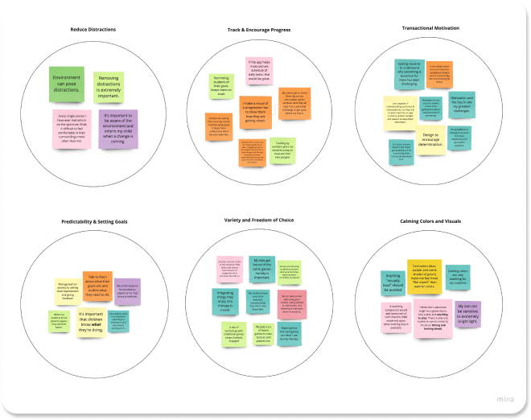
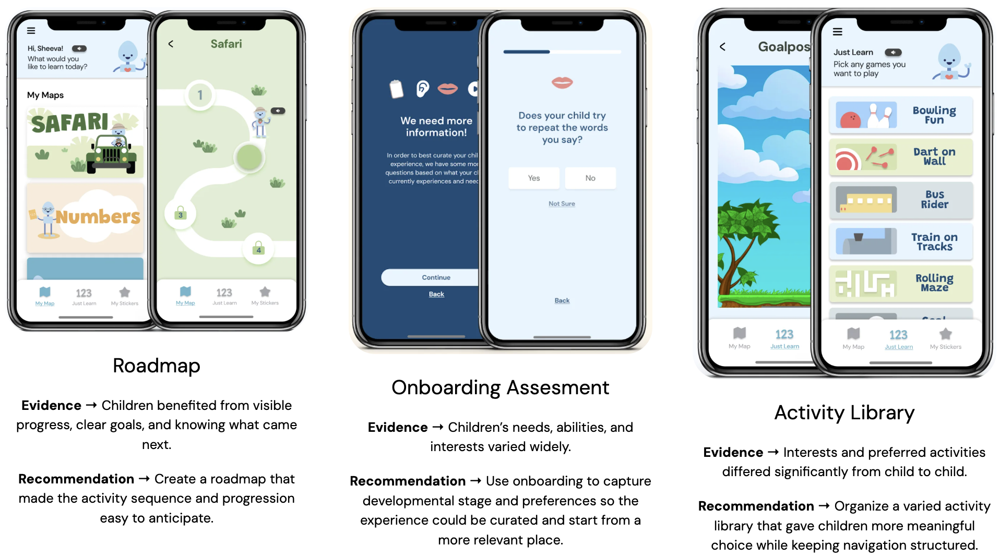
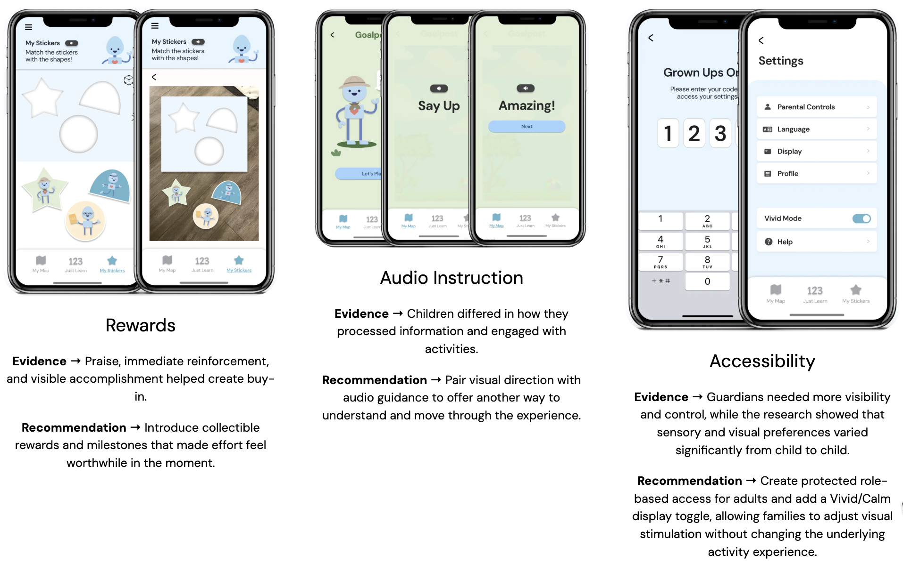

# Evidence to Product Decisions

## How I Synthesized the Research

I transcribed the participant interviews and converted meaningful observations into individual notes.

I initially worked through the evidence independently, looking for repeated ideas across guardians, speech-language pathologists, and the education perspective. I then transferred the synthesis into our shared Miro workspace so the broader team could inspect the patterns and use them during the design process.

Affinity mapping helped me move from individual comments to recurring conditions shaping engagement.

*The synthesis grouped observations around six recurring conditions: reducing distraction, tracking and encouraging progress, immediate motivation, predictability and goal-setting, variety and choice, and calming visual or sensory considerations.*

The purpose was not to create themes for their own sake.

I needed to understand what those patterns implied for the product.

Several of the themes began connecting to one another:

- progress and predictability suggested a clearer sense of progression;
- immediate motivation suggested rewards and visible accomplishment;
- variation in interests suggested greater activity choice;
- sensory and visual differences suggested more adaptable presentation;
- differences in how children processed instructions suggested multiple forms of guidance.

Those connections became the bridge between research evidence and product direction.

## From Evidence to Design

Once the synthesis was complete, I translated the recurring patterns into functional recommendations for the UI team.

My role was to define **what the experience needed to support**, not to prescribe the final interface. Ayami translated those recommendations into the prototype concepts shown below.

**Prototype UI:** Ayami  
**Research direction and recommendations:** Catherine Geissler

The prototype explored all six directions our team chose to carry forward:

1. Activity roadmap
2. Onboarding assessment
3. Activity library
4. Rewards
5. Audio instruction
6. Accessibility and parent controls

The visuals show the design team's interpretation of the research recommendations. They are not intended to imply that every direction had the same type or strength of supporting evidence.

## Not Every Recommendation Had the Same Evidence Strength

One thing I would describe differently today is the six recommendations.

They were not equally supported.

Some came directly from repeated participant evidence.

Others were strengthened primarily by competitive or accessibility research.

That distinction matters.

### 1. Activity Roadmap

**Evidence strength: Strong**

Participants repeatedly surfaced:

- progress visibility;
- predictability;
- knowing what came next;
- maintaining motivation over time.

The roadmap addressed those needs by making progression visible rather than leaving the structure entirely in the clinician's head.

It also reflected a broader product requirement:

**if ASD123 was going to work at home, some of the structure normally supplied by the therapist needed to exist in the product.**

### 2. Rewards and Milestones

**Evidence strength: Strong**

The education and clinical perspectives reinforced the importance of immediate buy-in.

Long-term speech improvement is meaningful to adults but abstract to a child.

Children often need a reason to care about the current activity.

Rewards translated therapeutic progress into something immediate and recognizable within the language of children's games.

### 3. Activity Library

**Evidence strength: Strong**

Interests varied substantially between children.

A single path through the product risked assuming that the same activities would motivate everyone.

The activity library introduced choice while preserving a structured therapeutic environment.

### 4. Accessibility and Parent Controls

**Evidence strength: Moderate to strong**

The research suggested wide variation in sensory preferences and environmental needs.

Accessibility research reinforced that finding.

I recommended greater control over visual stimulation and a protected parent area.

Looking back, I would have preferred more than a binary "vivid / non-vivid" treatment.

The research suggested a spectrum, not two universal states.

### 5. Audio Guidance

**Evidence strength: Moderate**

Accessibility research and participant discussions suggested value in multiple routes for understanding instructions.

Audio guidance was therefore recommended as a complementary interaction mode.

I considered this useful, but not as central to the research story as roadmap, rewards, or activity choice.

### 6. Onboarding Assessment

**Evidence strength: Competitive / structural**

Competitors frequently used onboarding to establish developmental level, goals, or personalization.

The idea was therefore well supported as a category pattern.

However, I was less confident that our team should specify the details of a speech assessment.

That belonged much closer to clinical expertise.

My recommendation was that the product make room for an assessment and personalization layer rather than pretending the research team could define the clinical instrument itself.

## Breadth Versus Depth

This became one of the main product-team tensions.

I preferred to focus on fewer recommendations and develop them more deeply.

The UI team felt they could explore all six within the sprint.

We discussed the tradeoff and ultimately chose to visualize the full recommendation set.

I was comfortable with that decision as long as the core research logic remained intact.

In a real product environment, however, I would probably make a different call.

I would prioritize the strongest hypotheses and test them earlier before investing heavily in additional interface work.

## The Research-to-Design Handoff

The handoff was collaborative rather than a formal document thrown over a wall.

I kept the Miro board current throughout the sprint and walked the team through:

- what had emerged;
- why it mattered;
- what each recommendation needed to accomplish.

The team then decided together what to carry forward.

My role was functional.

I defined what the evidence suggested the experience needed to support.

Ayami owned the visual and interaction design.

That division worked well.

I did not need to prescribe the interface for the research to influence the product.

## The Larger Product Principle

The six recommendations eventually condensed into one broader strategy:

> **Guided flexibility**

The product needed enough structure to:

- orient the child;
- create progression;
- maintain therapeutic continuity;
- reduce uncertainty.

At the same time, it needed enough flexibility to:

- reflect different interests;
- accommodate sensory variation;
- support different levels of attention;
- give families meaningful control.

That principle became more useful to me than any individual feature recommendation.
