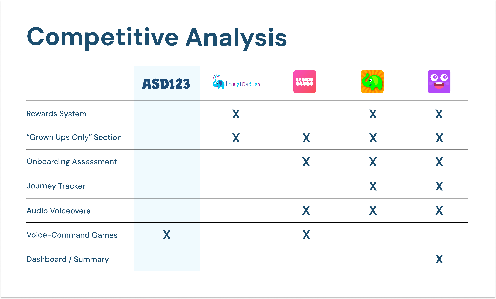

# Research Strategy

## Starting With a Knowledge Gap

Before the founder kickoff, I was worried about the limits of my own expertise.

ASD123 had originated around children with speech-development needs, including children with autism.

Speech-language pathologists understood those children clinically in ways I did not.

I did not want research to become an exercise in asking experts questions whose answers were already obvious to them.

The distinction I eventually made was:

**Clinical expertise and user-experience expertise were answering different questions.**

I was not there to define therapy.

I was there to understand what would make a therapeutic product understandable, motivating, supportive, and usable outside the therapy room.

That reframing defined the rest of the research.

## Working Before the Founder Kickoff

The founder meeting did not happen until five days into the three-week sprint.

I used that period as a discovery phase.

The team reviewed publicly available material about ASD123 and founder interviews so we could understand the product before the kickoff.

I created and maintained a Miro research board containing:

- research on children's UI patterns;
- research on designing for autistic children;
- accessibility and WCAG guidance;
- articles on sensory and visual considerations;
- examples of children's game design;
- competitive products;
- early brand and visual references.

I asked the UI team to contribute their own interpretation of accessibility, typography, color, shape, and children's interface design.

That collaboration became increasingly valuable.

The research team could identify evidence about user needs, while the UI team could interpret what that evidence might imply at the visual and interaction level.

Richie and I focused more heavily on competitive research.

I conducted most of the competitive investigation, with Richie serving as a second set of eyes as we narrowed a much larger working list into the final comparison.

By the founder kickoff, we had already developed enough category knowledge to ask more informed follow-up questions rather than beginning from zero.

## The Access Constraint

I expected more direct recruitment support from the client relationship than we ultimately had.

When access to ASD123's existing child users was restricted, I needed another research strategy quickly.

I considered the nature of the population and decided against recruiting unrelated children simply because they were easier to reach.

Children without relevant context could have produced convenient but misleading evidence.

Instead, I asked:

> **Who understands the environments surrounding these children?**

That led to a stakeholder-ecosystem approach.

## Why I Chose Each Participant Group

### Speech-language pathologists

I wanted clinicians to help me understand:

- how therapy sessions were structured;
- what maintained engagement;
- what affected temperament and participation;
- what children gravitated toward;
- what clinicians needed families to continue between sessions;
- what happened when therapeutic consistency broke down.

A particularly important theme was regression between sessions.

That made the product opportunity larger than simply "more games."

ASD123 could potentially support continuity when the clinician was not present.

### Guardians

With guardians, my questions changed.

I wanted to understand:

- what practice looked like at home;
- how parents wanted to participate;
- where involvement became difficult;
- how they understood progress;
- what they wanted to know about their child's development;
- what helped create a supportive environment.

The interviews did not suggest that parents lacked motivation.

They often lacked **visibility and structure**.

They wanted to know what progress looked like and what their role should be.

That distinction later influenced my interest in a stronger parent experience.

### Special-education perspective

The education interview focused much more heavily on:

- motivation;
- attention;
- regulation;
- preferred activities;
- what children repeatedly gravitated toward;
- what could overwhelm or disengage them.

This perspective helped sharpen the concept of **buy-in**.

The product needed to give children an immediate reason to participate rather than relying only on a distant therapeutic benefit.

## Recruitment Under Time Pressure

Recruitment happened largely through resourcefulness rather than an existing participant panel.

One connection came through someone who was open about having an autistic daughter and helped connect me with an SLP.

I also researched speech-language pathologists who worked at the intersection of therapy and technology and contacted professionals whose published work suggested they could contribute to the product question.

Other participants came through network connections after people in the cohort learned that I was struggling to reach relevant families.

The final sample was:

- 4 speech-language pathologists
- 2 guardians
- 1 special-education teacher

The mix was partly strategic and partly constrained by what could realistically be recruited in roughly one week.

I would have preferred additional educator perspectives.

## Different Participants Required Different Interview Guides

I did not use one generic script across all seven participants.

Each group held different evidence.

Clinicians were asked about therapeutic structure and continuity.

Guardians were asked about home use and support.

Education questions focused on attention and motivation.

The overlapping questions were around:

- engagement;
- predictability;
- sensory needs;
- autonomy;
- activities;
- reinforcement.

That overlap allowed me to compare patterns without pretending the participants were interchangeable.

## What Surprised Me

One of my biggest assumptions going into the research was that designing for children with autism or speech-development needs might require a fundamentally different motivational model.

The evidence complicated that assumption.

Children still responded to familiar forms of play, progress, rewards, activities, and choice.

What changed was often the degree of sensitivity required.

Distraction, regulation, sensory input, and predictability needed more deliberate attention.

The research therefore moved away from thinking about a completely separate kind of child experience.

A better framing became:

> **Build a familiar child-centered experience with enough flexibility to accommodate a wider range of needs.**

For me, that was one of the most meaningful findings in the project.

## Why Competitive Analysis Became More Important

Competitive analysis was always useful for benchmarking.

ASD123 wanted to become a children's gaming product that also served a therapeutic purpose.

I therefore chose competitors that had already moved successfully between those worlds.

But competitive research became even more important after recruitment constraints emerged.

With seven participants spread across several stakeholder groups, I did not want to overstate confidence in any single interview pattern.

Competitive evidence provided another source against which I could compare emerging recommendations.

*The working competitive analysis was broader than the final artifact shown here. I narrowed the comparison to products most relevant to ASD123's goal of combining therapeutic value with a children's gaming experience.*

The comparison was not intended to prove that common competitor features were automatically right for ASD123.

I used it to distinguish between two different questions:

1. **What had become a category expectation?**
2. **What did our own research suggest ASD123 actually needed?**

That distinction became important later. For example, onboarding appeared consistently across competitors, but I was less confident that our team should define the details of a clinical speech assessment. By contrast, visible progression, rewards, and activity choice were supported more directly by participant evidence.

Competitive research therefore helped me benchmark the product without treating competitors as substitutes for user evidence.

We considered expanding the analysis to mainstream children's games mentioned during interviews.

Given the timeline, we chose not to add another research stream.

That was a scope decision rather than a belief that those products were irrelevant.

## Evidence Triangulation

No single source determined the recommendations.

I combined:

**stakeholder interviews + competitive research + market research + accessibility research**

The purpose of triangulation was not to create the appearance of certainty.

It was to understand whether different evidence sources were pointing toward compatible decisions.

That became especially important because direct child-user research was unavailable.
